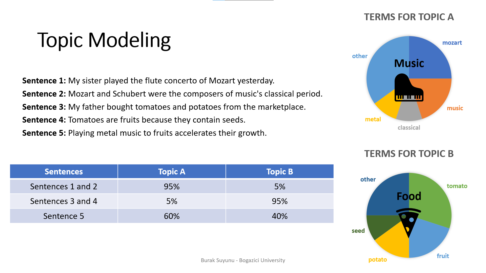

# Theme Supervised Nonnegative Matrix Factorization for Topic Modeling

**Ms Thesis for Bogazici University Computer Engineering Department by Burak Suyunu**

## Abstract

Topic models are often used to organize and interpret large and unstructured corpora of text documents. They try to explain the topics that constitute the semantic infrastructure of the document sets and try to find the distributions of these topics for the documents. Because of its unsupervised nature, the outputs of a topic model has to be interpretable to represent its success. However, the results of a topic model are usually weakly correlated with human interpretation. In this thesis, we propose a semi-supervised topic model called Theme Supervised Nonnegative Matrix Factorization that can benefit from labeled documents to improve and facilitate the interpretation of the topics. Our model constrains the representation of the topics to align with the labeled documents and this enables the topics discovered by the model to be readily understood. To utilize the labels provided by the documents more efficiently and to explore the document sets in more depth, we used a hierarchical topic structure consisting of themes, subtopics, and background topics in our model. We created layers under the themes that permit unsupervised learning for subtopics. This hierarchical structure, with the unsupervised learning capability it provides, enables our model, which was restricted with supervision, to discover new dimensions and make more detailed classifications. We tested our model on Schwartz dataset we created, as well as Brown and Reuters datasets with different supervision ratios. Our model estimates the topics of the documents much better than the traditional nonnegative matrix factorization and latent Dirichlet allocation for any situation; and besides, the effect of supervision is noteworthy, especially at low ratios. Moreover, our new term scoring metric successfully alters the weights of significant and insignificant terms for each topic and makes the topics easier to understand and interpret.

 

## Topic Models

* Topic modeling is a ML and NLP technique for discovering hidden (latent) topics that occur in a set of documents.
* The underlying idea is that the semantics of documents are being governed by some latent variables that we do not observe.
* The goal of topic modeling is to uncover these latent variables - topics - that shape the meaning of documents.
* Topic models scan a set of documents and find the distribution of terms under latent topics that best characterize the documents using the statistics of the terms in the documents.
* There are two assumptions that all topic models are based on:
  * Each document consists of a mixture of topics. 
  * Each topic consists of a collection of terms.

### Example

 
 

### The Model

1. Traditional topic models are unsupervised => Don’t use labeled documents for training.
2. Unsupervised models produce faster results with less preprocess
3. No prior knowledge to verify results => Human interpretation takes an important role in the analysis of the results.
4. Analyze term distributions of the topics => Find out what each topic corresponds to.
5. Results can be weakly correlated with human interpretation
6. Not always have such clear term distributions, or we may have multiple intertwined topics.
7. So, what if we could increase the interpretation power of topic models while having the classification power of supervised methods?
8. Combined the beauties of these two worlds to come up with a novel semi-supervised topic model called **Theme Supervised Nonnegative Matrix Factorization (TSNMF)**

 

 
 

### Text Preprocessing

* Fix some wording and text emoticons using a manually crafted dictionary, such as “isn’t” to “is not” and “:)” to “smile”.
* Remove **stopwords, punctuation, numbers**, and any token with fewer than **3 characters long**.
* Tokens are lemmatized using Wordnet **lemmatizer** of Natural Language Toolkit (NLTK).
* **Removed** documents that have less than **25 words**.
* **n-gram** word model is used combining unigrams, bigrams, and trigrams to generate a dictionary
* To **prevent over-populating** the dictionary, only the most frequent 10,000 terms are considered.
* We used both **tf** and **tf-idf** separately to encode documents into he document-term matrix in our experiments

